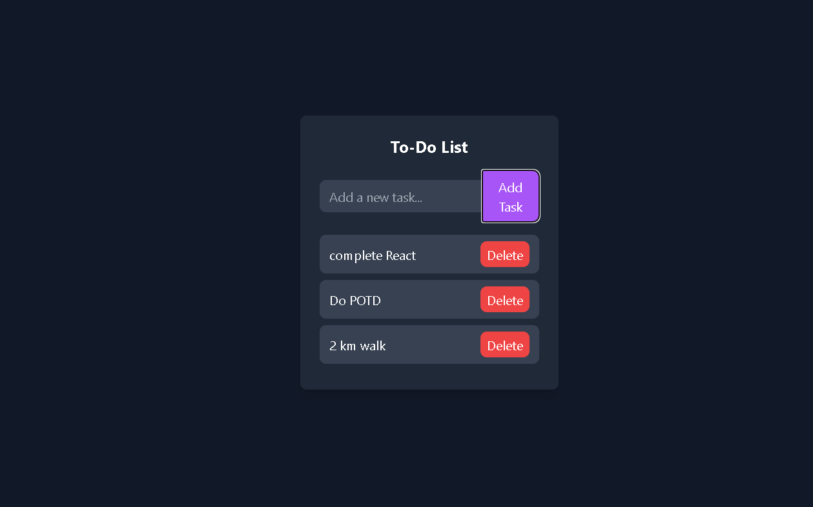

<!DOCTYPE html>
<html lang="en">
<head>
    <meta charset="UTF-8">
    <meta name="viewport" content="width=device-width, initial-scale=1.0">
</head>
<body>

<h1 align="center">📝 To-Do List</h1>

    A simple, minimalistic To-Do List application built with HTML, CSS, and JavaScript.

<h2>📌 Features</h2>
<ul>
    <li>Add new tasks</li>
    <li>Delete tasks</li>
    <li>Dark theme UI</li>
</ul>

<h2>🖼 Preview</h2>

    

<h2>🚀 How to Use</h2>
<ol>
    <li>Clone the repository:
        <pre><code>git clone https://github.com/rishipandey14/todo-list.git</code></pre>
    </li>
    <li>Open <code>index.html</code> in your browser.</li>
    <li>Add tasks using the input field and click "Add Task".</li>
    <li>Click "Delete" to remove a task.</li>
</ol>

<h2>🛠 Technologies Used</h2>
<ul>
    <li>HTML</li>
    <li>CSS</li>
    <li>JavaScript</li>
</ul>

<h2>📬 Contact</h2>
<ul>
    <li>Email: <a href="mailto:work.rishi14@gmail.com">work.rishi14@gmail.com</a></li>
    <li>LinkedIn: <a href="https://www.linkedin.com/in/rishipandey14/" target="_blank">rishipandey_14</a></li>
</ul>

</body>
</html>
